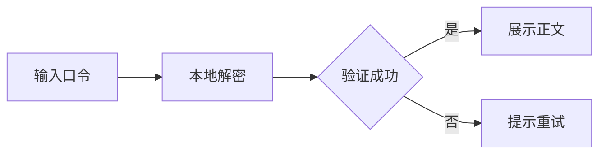

# 已解锁的示例文章

恭喜！你已成功解锁这篇示例文章。

这里的内容只用于验证加密文章的显示效果。请勿将生产密钥或真实私人资料放入演示数据。

## 工作方式

正文在生成公开数据时加密，页面只获得密文。输入正确口令后，浏览器在本地解密并渲染内容。

```typescript
interface ProtectedContent {
  salt: string;
  iv: string;
  data: string;
}

const state = { unlocked: false };
console.log("等待用户解锁", state);
```



## 公式与提示

解锁后的正文仍可展示数学公式：

$$P(A\mid B)=\frac{P(B\mid A)P(A)}{P(B)}$$

:::tip[提示]
重新进入页面时应重新检查当前解锁状态，避免把受保护正文带到其他页面。
:::

:::warning[警告]
公开搜索、订阅源与缓存都不应收录这段正文。
:::

## 项目卡片

::github{repo="LyraVoid/Shirone"}

## 使用边界

这是本地内容保护示例。需要真实账户、访问控制和审计时，应在下一阶段接入服务端权限系统。
