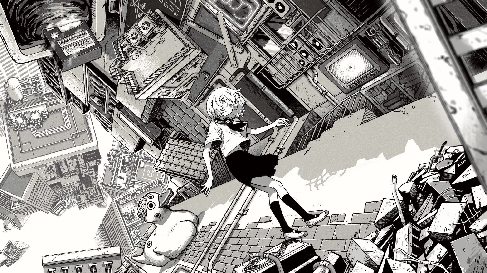

图片网格用来组织同一主题下的多张图片。点击图片可以查看大图，布局会随屏幕宽度调整。

## 基本写法

```markdown
:::grid{columns="3" aspect="16/9" fit="cover"}

:::
```

## 最简网格

:::grid



:::

## 列数与图片比例

:::grid{columns="3" aspect="16/9" fit="cover"}


:::

## 图片说明与替代文本

:::grid{columns="3" aspect="1/1"}


:::

## 裁切与完整显示

:::grid{columns="3" aspect="16/9" fit="cover"}


:::

:::grid{columns="3" aspect="16/9" fit="contain"}


:::

## 默认布局

:::grid


:::

## 三列竖幅图片

:::grid{columns="3" aspect="3/4"}


:::

## 三列横幅图片

:::grid{columns="3" aspect="16/9"}


:::

## 两列方形图片

:::grid{columns="2" aspect="1/1"}


:::

## 四列完整显示

:::grid{columns="4" aspect="16/9" fit="contain"}


:::

## 单列细节展示

:::grid{columns="1" aspect="16/9"}

:::

## 五列稀疏排列

:::grid{columns="5" aspect="1/1"}


:::

## 六列混合构图

:::grid{columns="6" aspect="1/1"}


:::

## 四列方形图片

:::grid{columns="4" aspect="1/1"}


:::

## 六列横幅图片

:::grid{columns="6" aspect="16/9"}


:::

## 三列竖幅图片

:::grid{columns="3" aspect="3/4"}


:::

## 裁切边缘与灯箱

:::grid{columns="3" aspect="16/9" fit="cover"}


:::

## 特殊比例图片

:::grid{columns="3" aspect="16/9" fit="contain"}


:::

## 透明背景图片

:::grid{columns="1" aspect="16/9" fit="contain"}

:::

## 检查要点

- 替代文本说明图片内容，标题补充观看背景。
- `cover` 填满卡片，`contain` 保留整张图片。
- 小屏幕下减少列数，图片不会撑宽页面。
- 每组灯箱只在当前网格内切换图片。
