Mermaid 将文本描述转换为图表。下面保留了常见图表类型，适合说明流程、数据关系、排期和阅读路径。

## 流程图

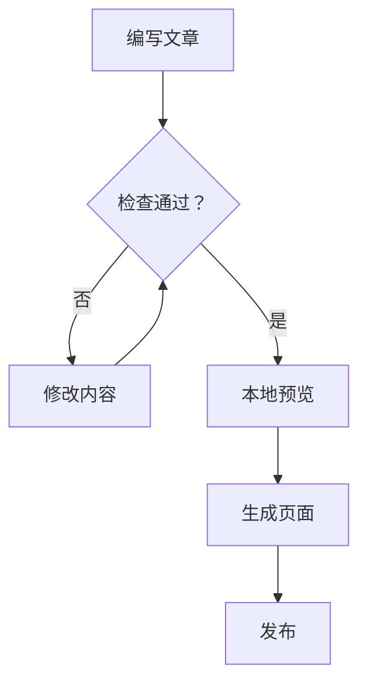

## 时序图

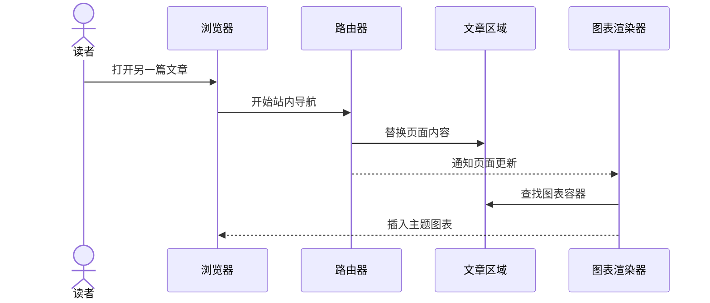

## 实体关系图

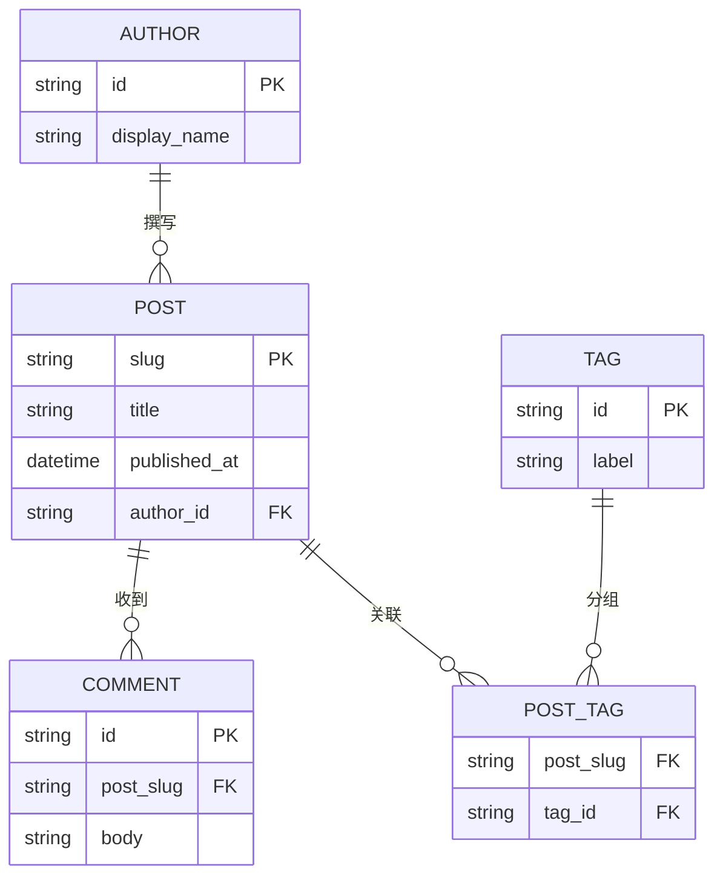

## 类图

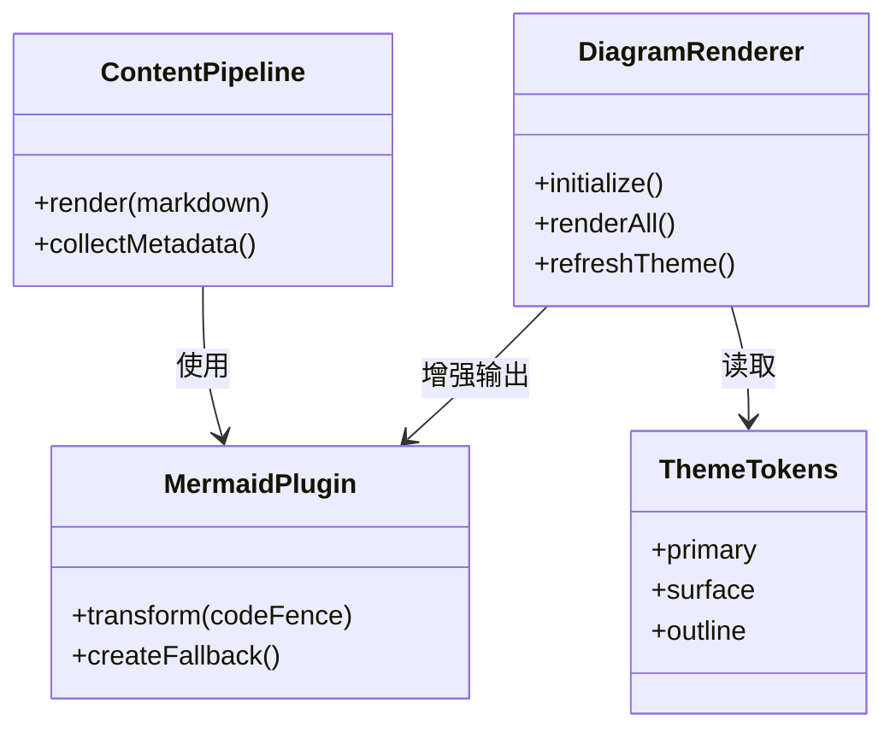

## 状态图

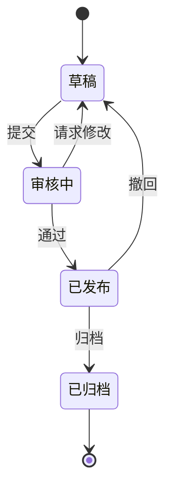

## 趋势图

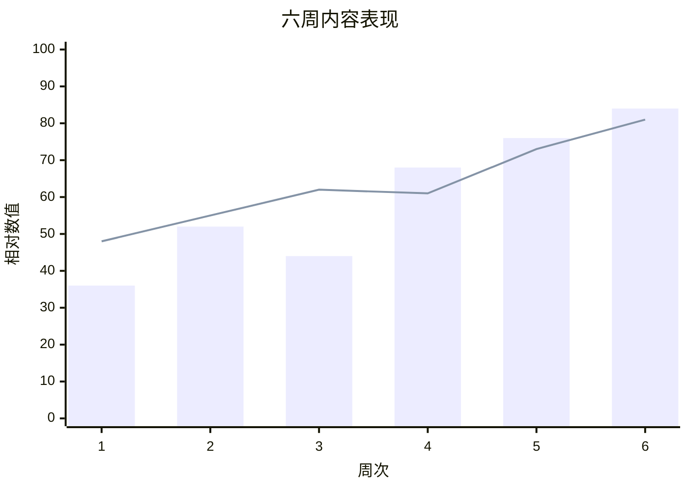

## 饼图

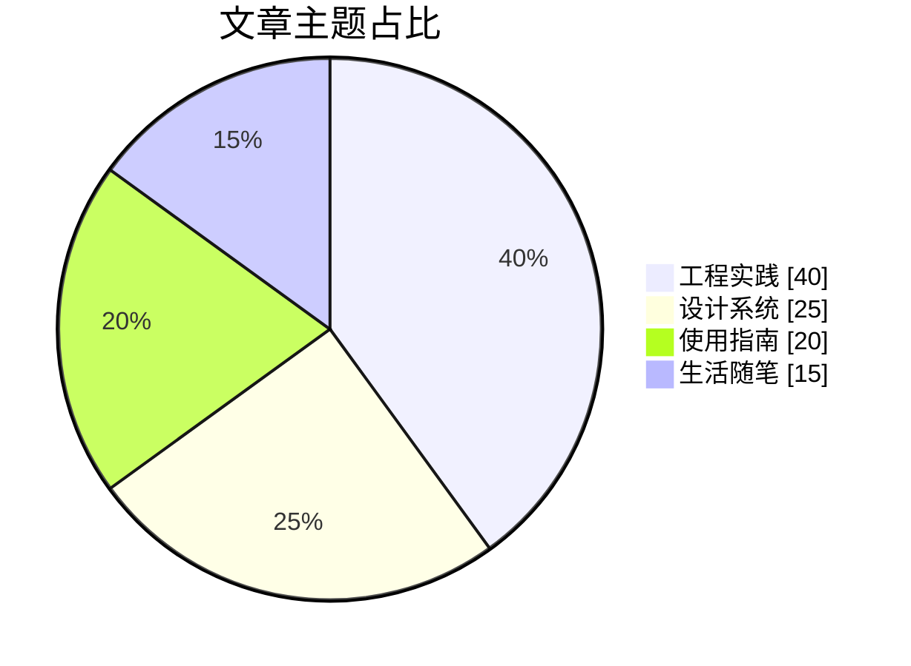

## 甘特图

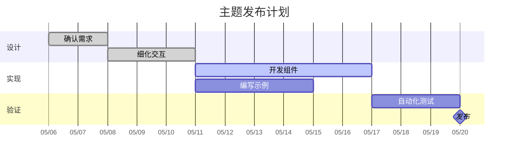

## 思维导图

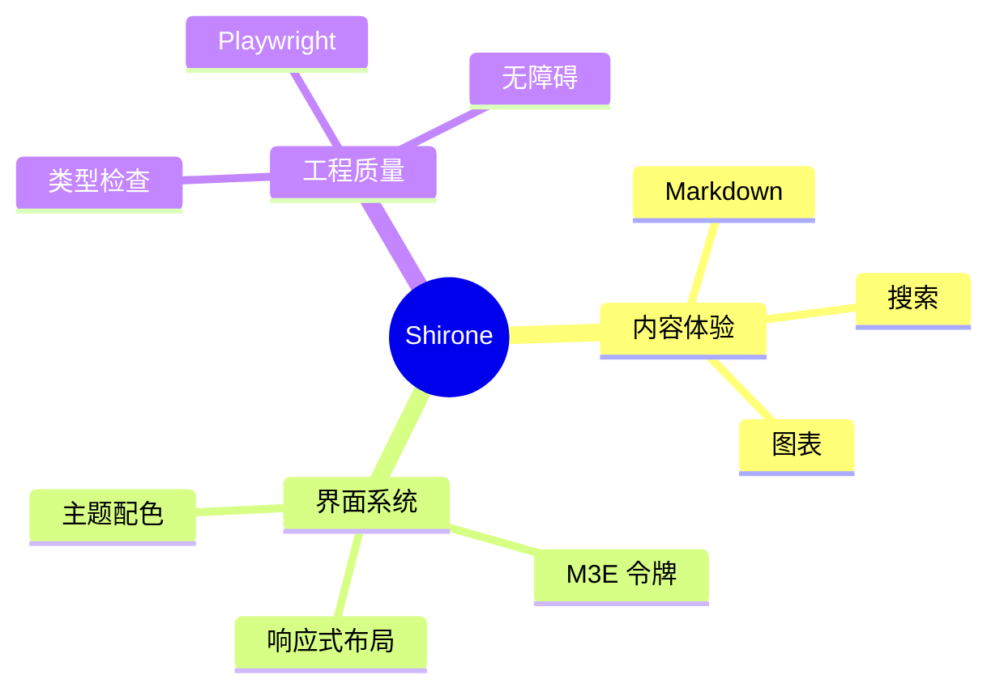

## 时间线

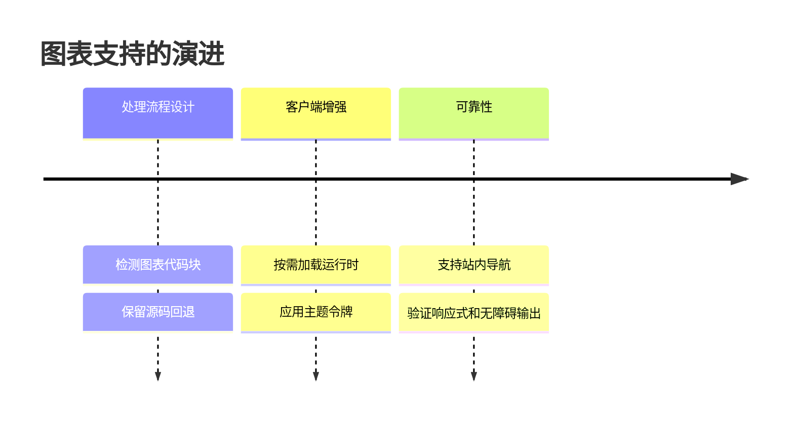

## 用户旅程

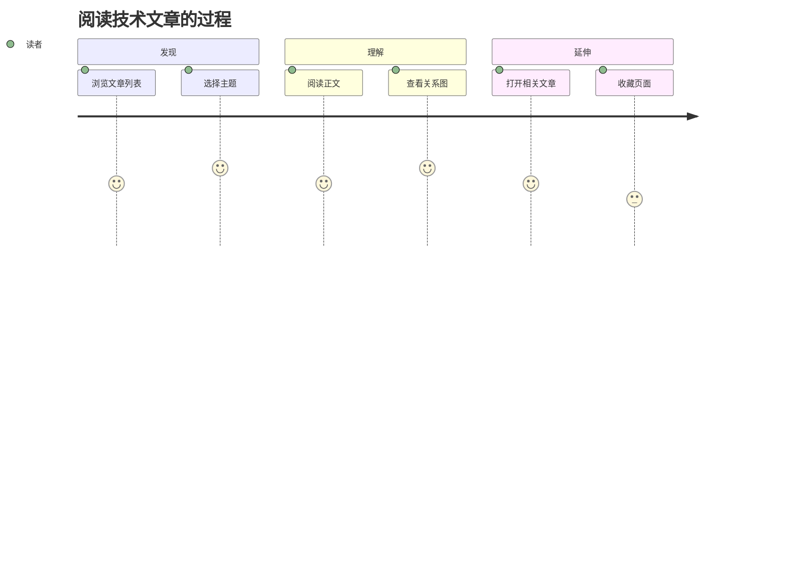

## Git 分支图

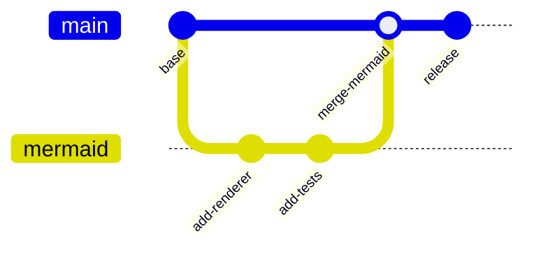

## 看板

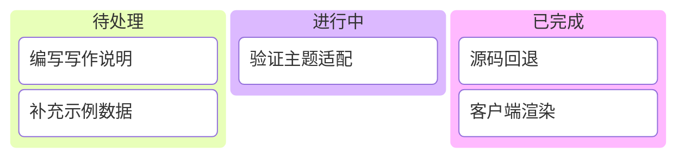

## 桑基图

当前图表解析器的桑基图节点仅支持 ASCII，因此示例保留节点标识：Home（首页）、Discover（发现）、Read（阅读）、Explore（探索）、Theme（主题）、External（外部链接）。

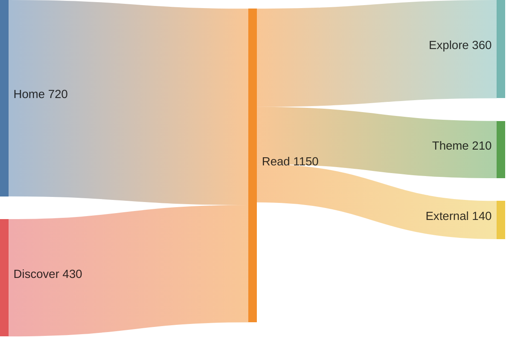

图表按文章实际需要加载。切换主题后会使用当前配色重新渲染，源码仍可作为无法运行图表时的回退内容。
