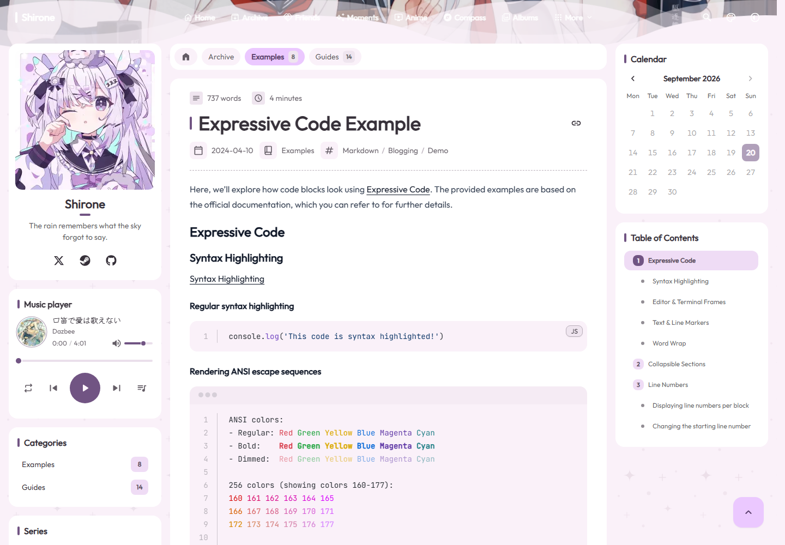

# 文章详情对比与优化

状态：Review。最后更新：2026-09-20。
关联：[迁移进度](../../migration-progress.md)、[数据契约](../../data-contract.md)、[验证记录](../../validation.md)。

本轮实际运行 Astro 4321 与 Nuxt 4322，检查 Markdown 基础、Expressive Code、Markdown 扩展三篇文章，视口为桌面 1440 × 1000 和手机 390 × 844。Nuxt 保留已确认的系统字体及中文内容，因此不以相同文字高度或像素一致作为验收目标。

## 已处理

- 标题旁恢复可键盘操作的复制链接按钮及状态反馈；手机标题调整字级并平衡换行。
- 有封面的文章恢复正文前的响应式图片；无封面文章保留分隔线。
- 代码块使用 M3E 表面色、等宽字体与原版行距；普通 prose 样式不再覆盖 Expressive Code 的 padding。
- 复制按钮移到代码框而非滚动内容中；复制内容提取真实代码行，排除行号，切页清理按钮。
- 正文内恢复作者、发布时间和许可证，分享区收进同一文章卡片。许可及分享尊重已有开关，均关闭时不留下空白 footer。
- 接入更新时间及过时提示配置；优先使用 frontmatter updated，按构建日与 UTC 日期计算天数。
- 标题锚点预留固定顶栏空间，长目录内部滚动；长公式在 SSR 中提供键盘焦点。

## 截图

| 原版 | Nuxt 修复前 | Nuxt 修复后 |
| --- | --- | --- |
|  |  |  |

[手机正文](after-mobile.png) · [文章底部](after-footer.png)

完整临时截图和几何测量保存在 `nuxt4/.cache/article-comparison/`；重新采集时在 Nuxt 目录运行 `node scripts/compare-article.mjs before` 和 `node scripts/compare-article.mjs after`。

## 对比服务

Windows 当前 Node 22.12.0 下，旧站需要先安装根依赖并生成本地图标，然后仅为对比进程开启 TypeScript 转换：

```powershell
# 根目录
pnpm.cmd install --frozen-lockfile
node scripts/icons/generate-local-icons.mjs
node scripts/images/generate-moment-thumbnails.mjs
$env:ASTRO_DEV_BACKGROUND = '1'
node --experimental-transform-types node_modules/astro/bin/astro.mjs dev --port 4321 --config nuxt4/scripts/astro-reference.config.mjs
```

该参数仅用于旧站对比，没有升级系统 Node，也没有修改原站跟踪文件。

## 2026-09-20 文件树与代码树补齐

实际对照旧站 `markdown-enhancements`，修复 HTML 清洗丢失 `details.open` 与 SVG `viewBox`、遗漏 disclosure/Expressive Code 样式依赖，以及正文列表样式侵入 `not-prose` 组件的问题。文件切换清除 SSR 的内联隐藏样式，更新键盘焦点；放大窗口保留样式作用域、名称和退出焦点，代码复制在窗口内仍可使用。

[旧版代码树](code-tree-original.png) · [Nuxt 代码树](code-tree-nuxt.png) · [手机放大窗口](code-tree-mobile.png)

开发和生产各 10 项浏览器回归通过，覆盖文件切换、键盘、复制、窗口退出、客户端返回、无 JavaScript、手机布局与 axe；15 项 Node 测试、类型检查、ESLint 和生产构建通过。仅修复本篇增强组件链路，不代表所有 Markdown 扩展均已完整迁移。

## 尚未纳入本轮

原版的相关推荐、稳定随机推荐、系列上下篇、全站上一篇/下一篇，以及完整海报封面配置仍需继续迁移。本轮没有将文章详情标记为完全对齐。
